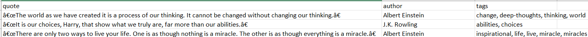

# Python Web Scapper - Quotes to Scrape 

A Python web scraping project that extracts quotes, authors, and tags from the Quotes to Scrape website using Request and BeatifulSoup.

## Features

- Scrape quotes from multiple pages
- Extract quote text, author, and tags
- Automatic rerty mechanism for failed request
- Request timeout handling
- Custom User-Agent support
- Save scraped data to CSV
- Periodically save progress during scrapping
- Gracefully handle manual interruption (Ctrl + C)

## Technologies

- Python 3
- Request
- BeautifulSoup
- Pandas

## Project Structure

```
web-scraping-news-scraper/
│
├── scraper.py
├── quotes.csv
├── requirements.txt
├── README.md
└── screenshots/
    └── output.png
```

## Instalation

Clone this repository

```bash 
git clone 
https://github.com/your-username/web-scraping-news-scraper.git
```


Install dependencies

```bash
pip install -r requirements.txt
```


Run the scraper

```bash
python scraper.py
```

## Sample output 

| Quote | Author | Tags |
|------|--------|------|
| "The world as we have created it..." | Albert Einstein | change, deep-thoughts, thinking, world |
| "It is our choices..." | J.K. Rowling | abilities, choices |

## Screenshots



## Future Improvements

- Save to Excel
- Save data into a database
- Add command-line arguments
- Support concurrent scraping
- Add logging
- Use Request Session for improved performance

## Lisence

This project is created for educational and portofolio purposes. 

## Key Learning

Through this project, I learned how to:

- Parse HTML using BeautifulSoup
- Handle pagination
- Implement retry mechanisms
- Handle timeout and network exceptions
- Export structured data into CSV
- Build maintainable Python code using modular fuctions
